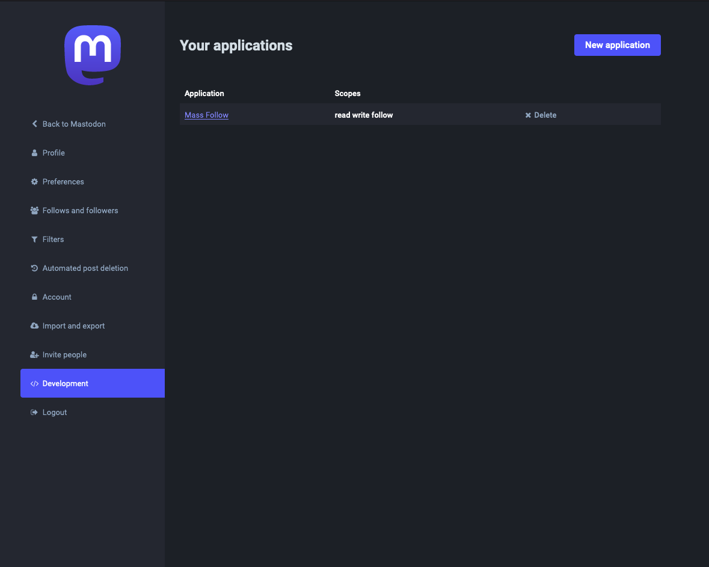
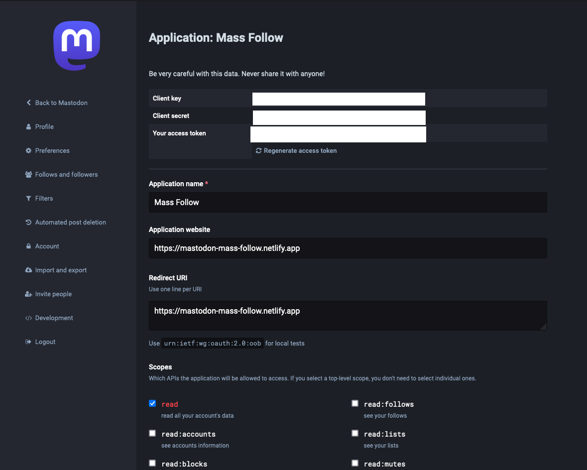
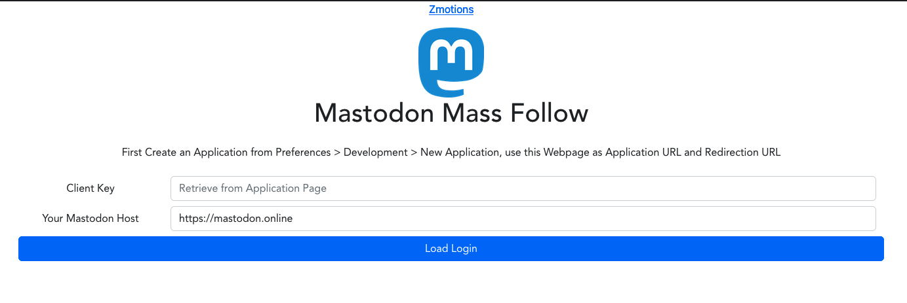
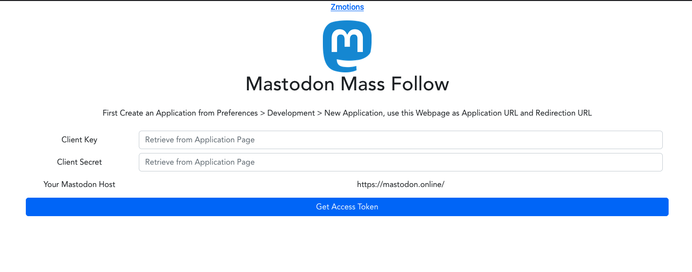
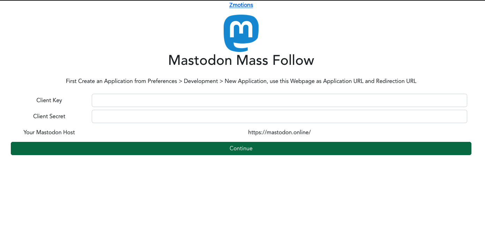
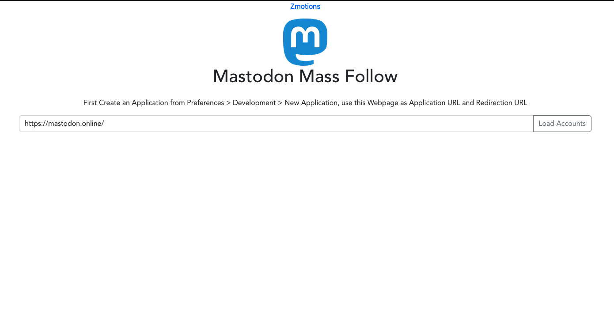
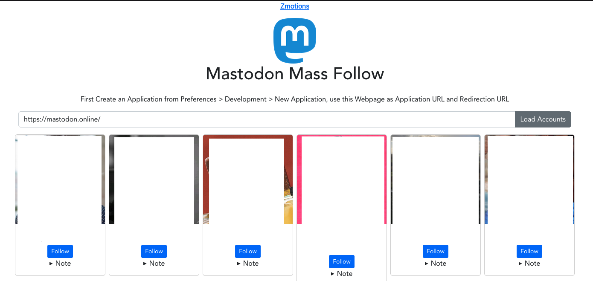

# mastodon_mass_follow

Mass Follow Accounts on a certain Mastodon host.

# Status

Currently, with Application Setup on your Account (Preferences > Development > New Application)
and providing the Application URL and Redirection URL to https://mastodon-mass-follow.netlify.app
(auto-deployed personal instance), you can by providing client code, client key and client secret get the appropriate 
token for follow operations. Also, you can load all local accounts
from a certain mastodon host and follow them one by one.

Missing part: Algorithm to loop through the loaded accounts to follow all (trigger follow one by one) of them.

Will finish that whenever I get to that.

# Basic Flow (PoC for Mass Follow)









# TODOS
- Implement iteration over accounts for mass follow
- Make Redirection URL settable via environment
- Make Client Key settable via environment (would immensly simplify flow)
- Make Client Secret settable via environment (would immensly simplify flow)

## Project setup
```
npm install
```

### Compiles and hot-reloads for development
```
npm run serve
```

### Compiles and minifies for production
```
npm run build
```

### Lints and fixes files
```
npm run lint
```

### Customize configuration
See [Configuration Reference](https://cli.vuejs.org/config/).
